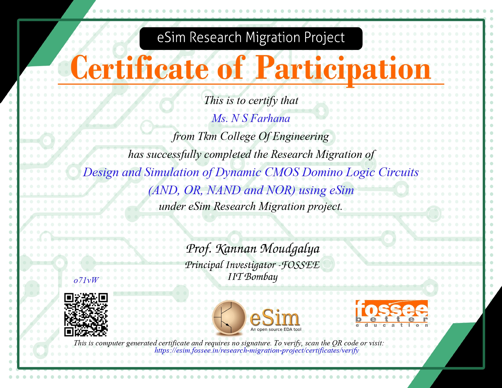
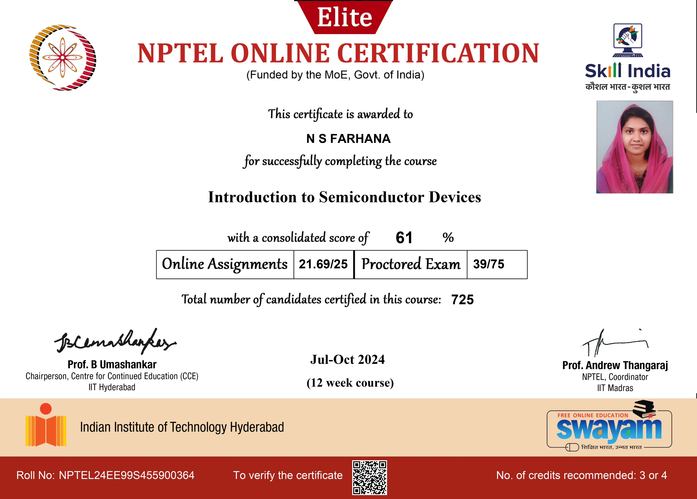
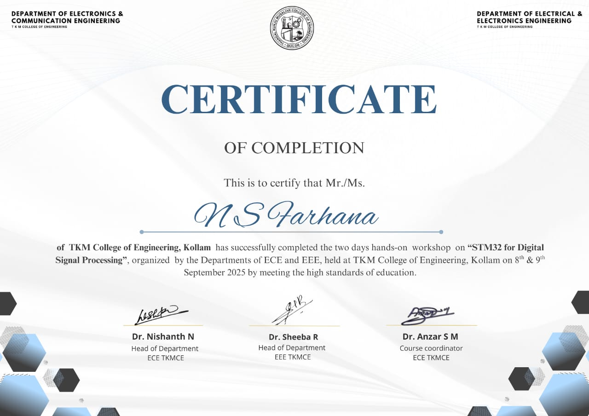
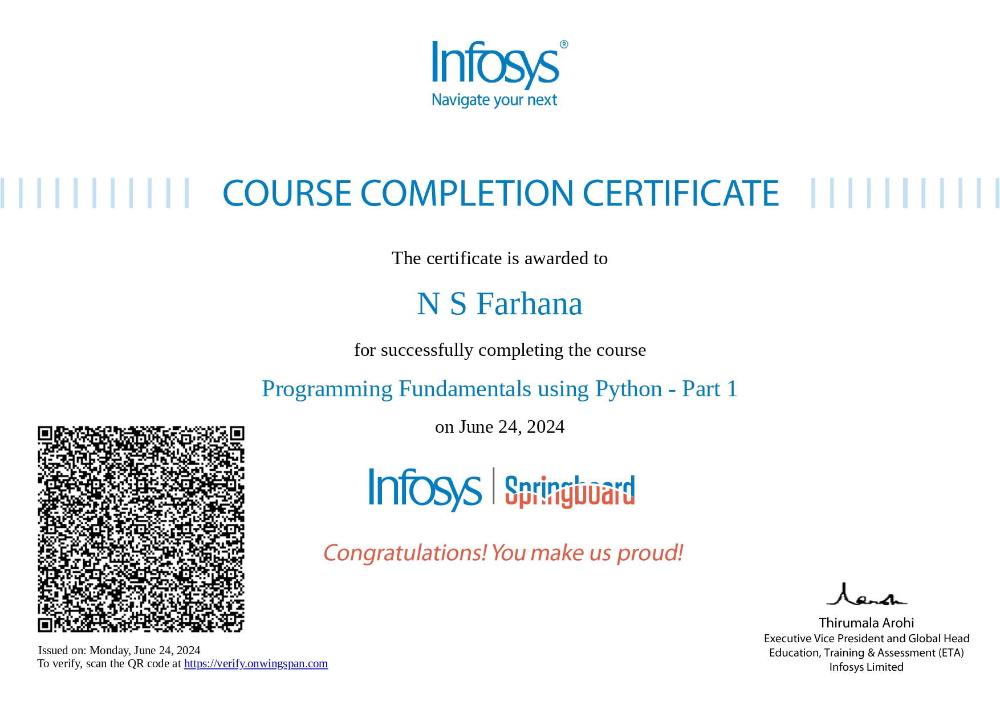
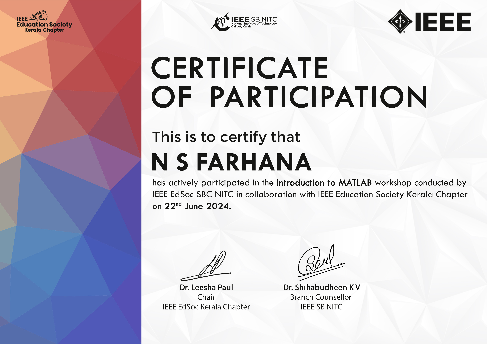
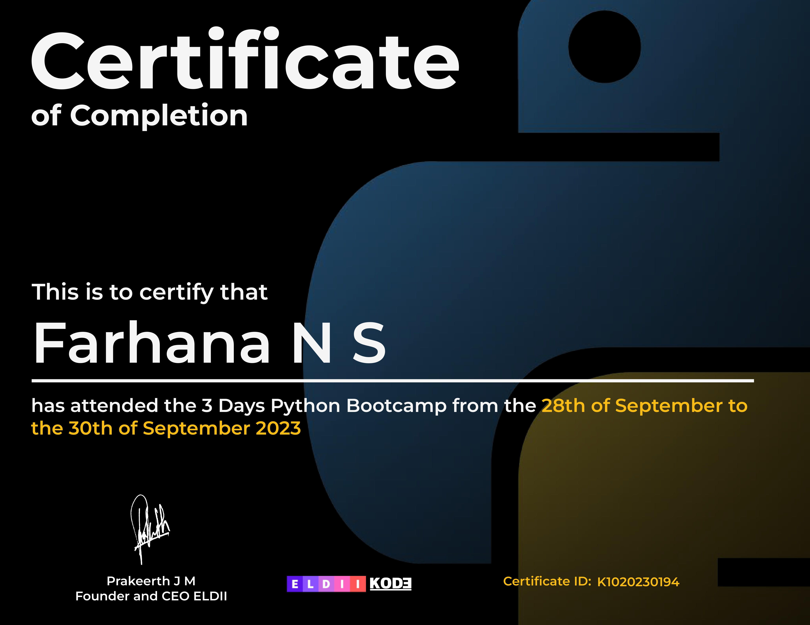
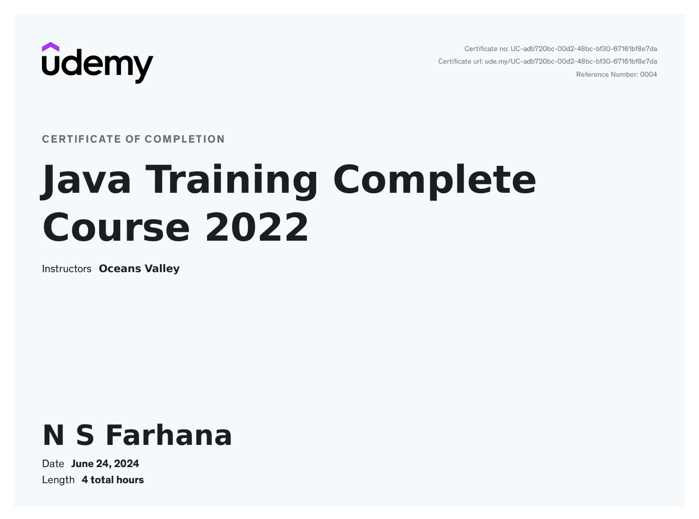
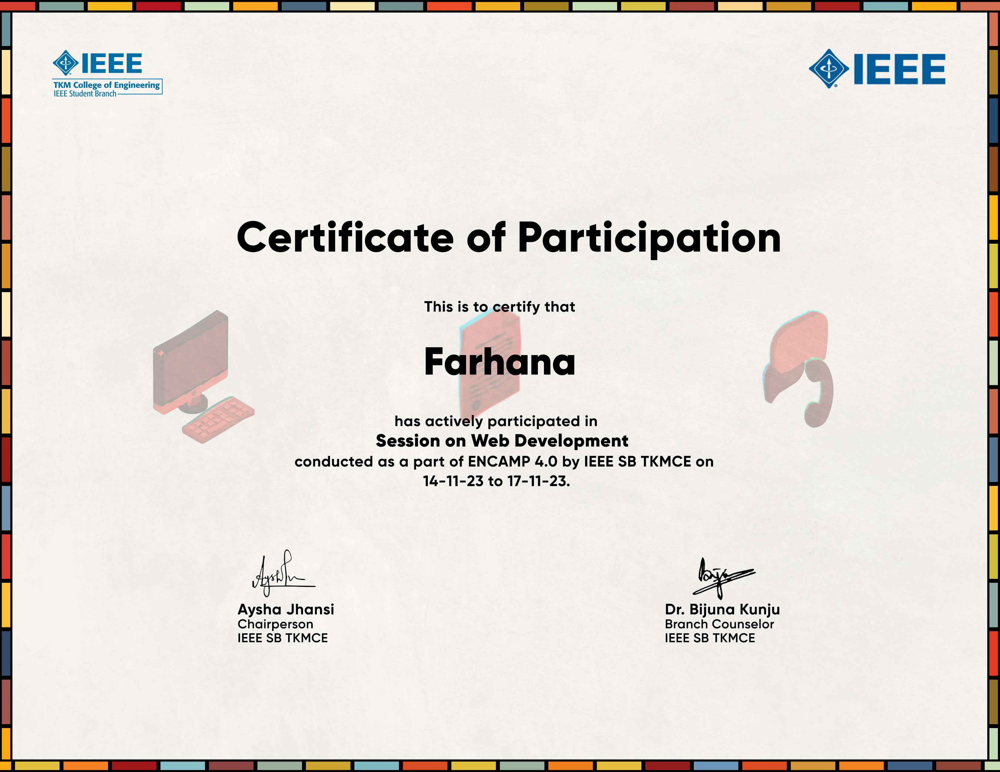
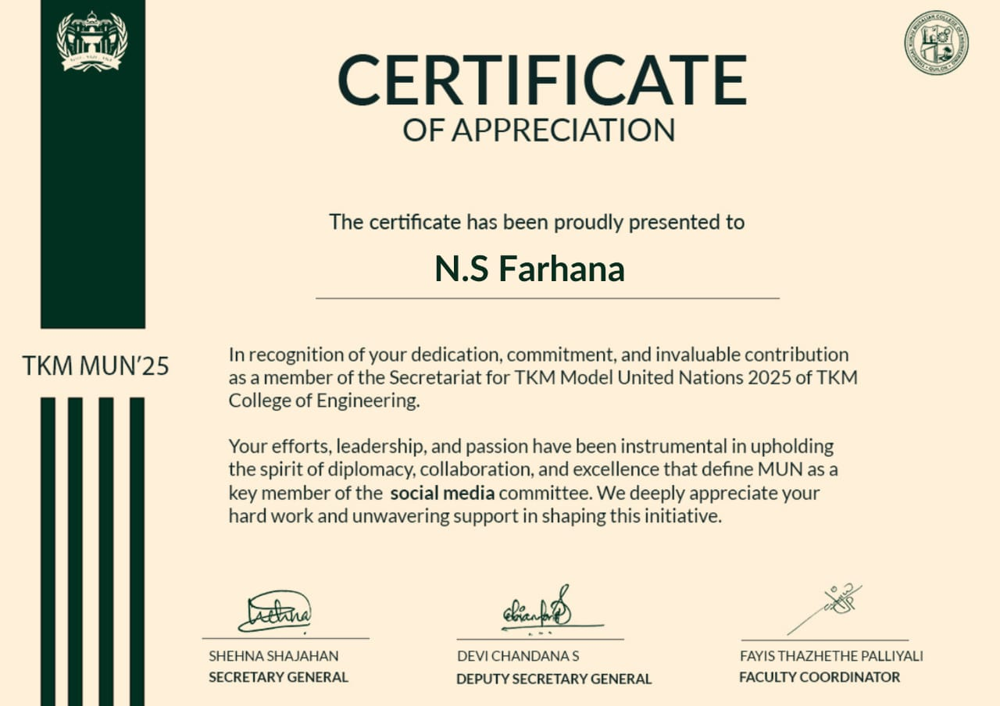

<h1 align="center">Hi 👋, I'm N S Farhana</h1>
<h3 align="center">ECE Student | IoT & Embedded Systems Enthusiast | Python | C programming | Verilog

---

## 🚀 About Me
- 🎓 B.Tech in Electronics & Communication Engineering (CGPA: 9.51)
- 🔧 Passionate about **IoT, Embedded Systems, and Smart Automation**
- 💡 Interested in **Embedded Systems & VLSI Design**
- ⚡ Love building real-world hardware + software integrated projects
- 🌱 Currently learning **Advanced IoT & Embedded AI**

---

## 🛠️ Tech Stack

### 💻 Programming
- Python | C | Embedded C (8051)

### 🔧 Tools & Software
- Arduino IDE | STM32CubeIDE | Keil  
- Cadence | LTSpice | MATLAB | Vivado  

### ⚙️ Hardware & Platforms
- Arduino UNO | ESP32 | ESP32-CAM  
- STM32 (NUCLEO-F411RE, Black Pill)

---

## 🔌 Academic Projects

### 🔐 Face Recognition Door Unlocking System
- ESP32-CAM + OpenCV based smart door lock  
- Matches faces and controls a solenoid lock via relay  

### 🌐 SafeSteps – Parent Support Platform
- Web platform for parents of children with disabilities  
- Tech: React , TypeScript , Vite , TailWind CSS , Shadcn-ui  

### 🎮 Voice-Controlled Game Console
- DSP-based vowel detection (FFT) using Black Pill  
- Controls gameplay using voice inputs  

### 🌡️ Temperature Controlled Fan
- Arduino + DHT11 sensor  
- Auto-adjusts fan speed based on temperature  

### 👏 Clap Switch
- Sound sensor-based ON/OFF control system  

---

## 📜 Certifications

---

### 🏅 Certification Highlights
- eSim Research Migration Project – FOSSEE, IIT Bombay  
- NPTEL Elite Certification – Introduction to Semiconductor Devices  
- STM32 for DSP Workshop  
- Python Programming – Infosys Springboard  
- MATLAB Workshop – IEEE EdSoc SBC NITC  
- Data Science & Analytics – HP LIFE Foundation  
- Java Complete Course – Udemy  
- ENCAMP 4.0 – Web Development Session  

---

## 🌍 Internship Experience
**Embedded Systems & IoT Intern – KELTRON | June 2 , 2025 - June 13 , 2025**  
- Worked with ESP32 & Arduino  
- Sensor interfacing (DHT22, MQ3, Ultrasonic, PIR, Soil Moisture)  
- Developed automation systems using relays & IoT cloud  

---

## 🏆 Achievements & Activities
- Member – IEDC Documentation Team 
- Secretariat Member – TKM Model United Nations 2025  
- Participant – IEEE & ISRO–TKMCE Sessions on Astrophysics and Space Industry Careers

  

---

## 📫 Connect With Me
- 📧 Email: nsfarhana.2004@gmail.com  
- 💼 LinkedIn: www.linkedin.com/in/n-s-farhana

---

⭐ *“Building technology that makes everyday life smarter and easier.”*
