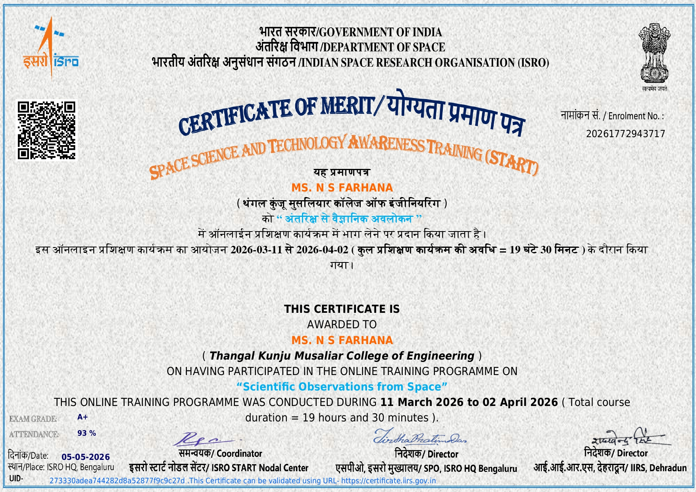
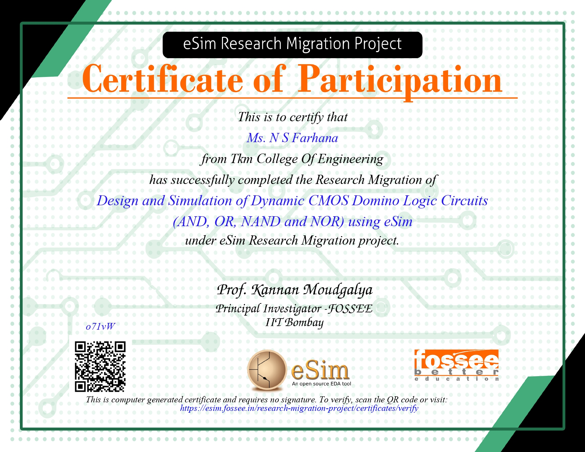
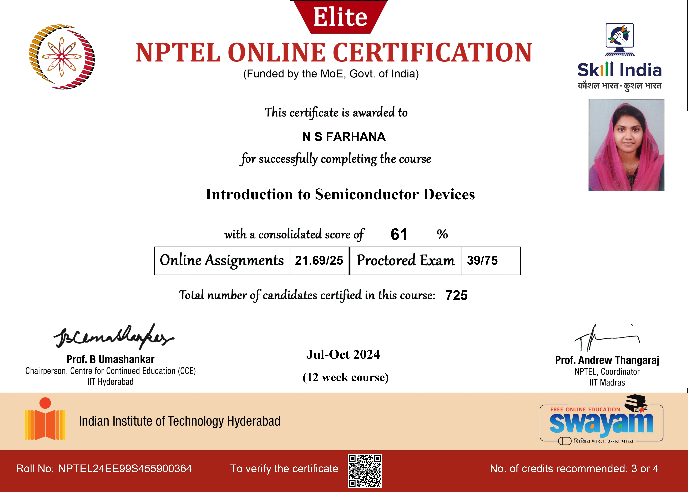
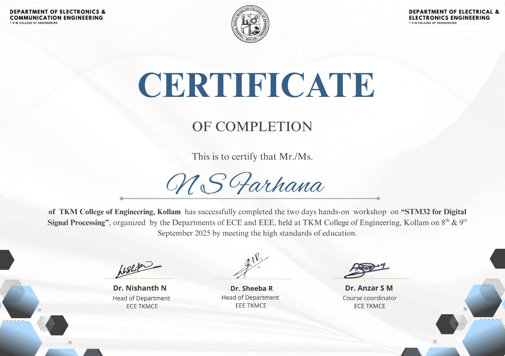
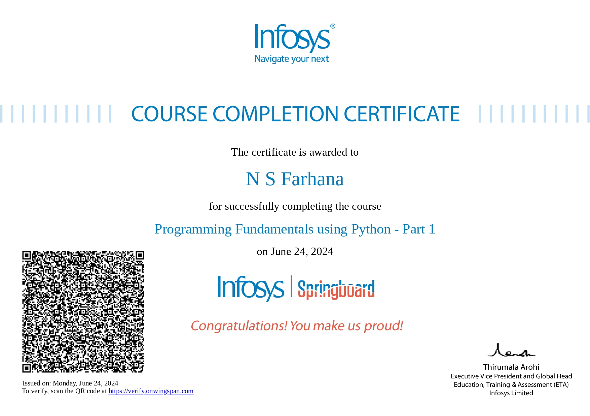
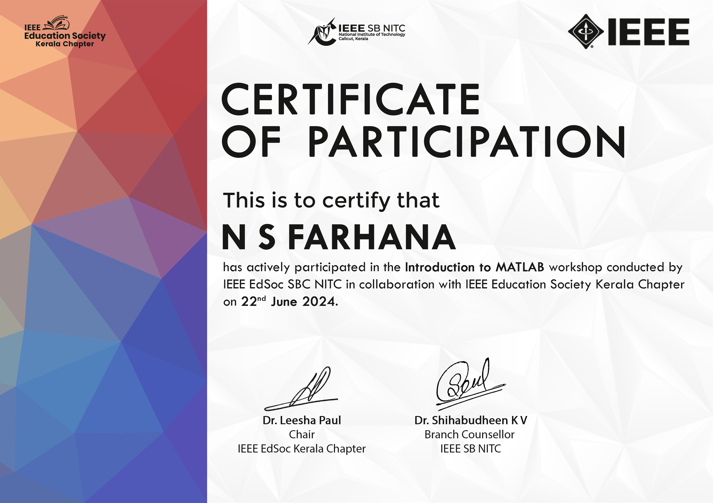
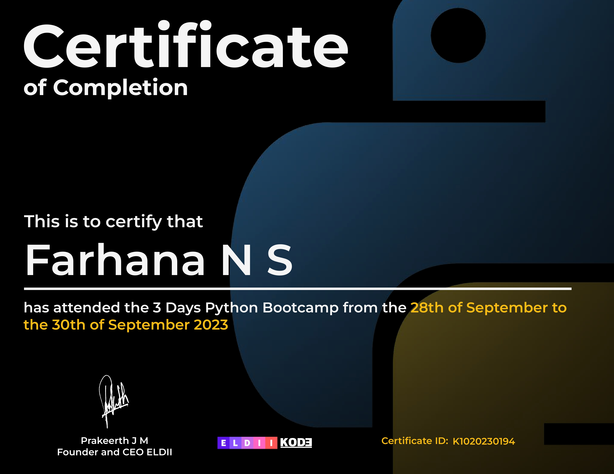
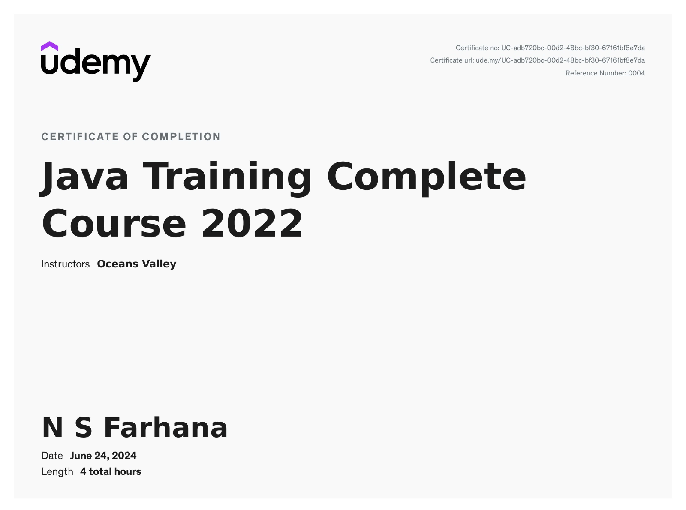
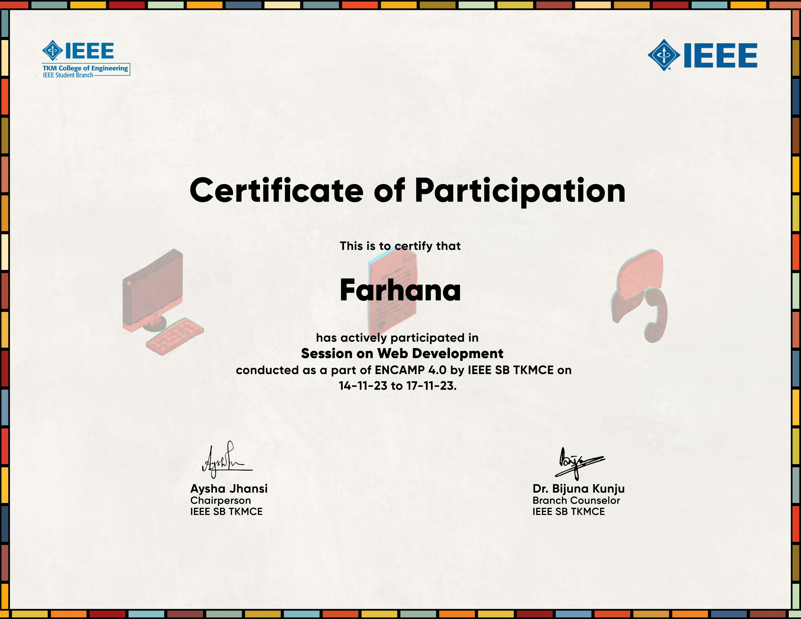
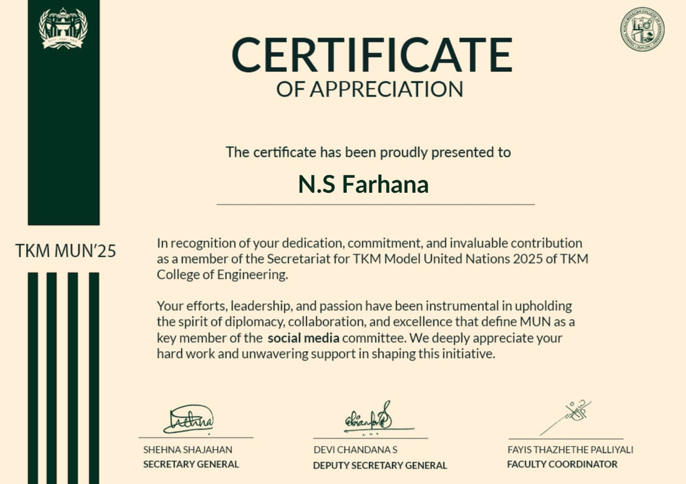

<h1 align="center">Hi 👋, I'm N S Farhana</h1> 
<h3 align="center">ECE Student | IoT & Embedded Systems Enthusiast | RTL Design | Python | C programming | Verilog

---

## 🚀 About Me

- 🎓 **B.Tech – Electronics & Communication Engineering** | CGPA: **9.60**
- 🔭 Currently working as **Summer Intern** at **FOSSEE , IIT BOMBAY**
- 🔧 Passionate about **IoT, Embedded Systems and VLSI Design**
- ⚡ Love building real-world **hardware + software integrated projects**
- 🌱 Currently learning **Advanced IoT & Embedded AI**
- ⚡ Enjoys **video editing & exploring new technologies**

---

## 🛠️ Tech Stack

**Languages**

**Tools & Software**

**Hardware & Platforms**

---

## 🔌 Projects

| # | Project | Tech Used | Highlights |
|---|---------|-----------|------------|
| 🔐 | **Face Recognition Door Lock** | ESP32-CAM, OpenCV, Python | Keyless access via face match + relay-controlled solenoid |
| 🌐 | **SafeSteps – Parent Support Platform** | React, TypeScript, Vite, Tailwind, Shadcn-ui | Web platform for parents of children with disabilities |
| 🎮 | **Voice-Controlled Game Console** | STM32 Black Pill, DSP, FFT | Vowel detection controls gameplay via voice input |
| 🌡️ | **Temperature Controlled Fan** | Arduino, DHT11 | Auto fan speed based on live temperature readings |
| 👏 | **Clap Switch** | Sound Sensor, Arduino | Sound-triggered ON/OFF control system |

---

## 🌍 Internship

**Embedded Systems & IoT Intern — KELTRON** `June 2025`

- Worked with **ESP32 & Arduino** for sensor interfacing
- Sensors used: DHT22, MQ3, Ultrasonic, PIR, Soil Moisture
- Built automation systems using **relays & IoT cloud** platforms

---

## 📜 Certifications

<table>
  <tr>
    <td align="center" width="400">
       
      <b>START Programme</b> 
      ISRO
    </td>
    <td align="center" width="400">
       
      <b>eSim Research Migration Project</b> 
      FOSSEE, IIT Bombay
    </td>
    <td align="center" width="400">
       
      <b>Semiconductor Devices</b> 
      NPTEL Elite
    </td>
  </tr>
  <tr>
    <td align="center" width="400">
       
      <b>STM32 for DSP</b> 
      Workshop
    </td>
    <td align="center" width="400">
       
      <b>Python Programming</b> 
      Infosys Springboard
    </td>
    <td align="center" width="400">
       
      <b>MATLAB Workshop</b> 
      IEEE EdSoc SBC NITC
    </td>
  </tr>
  <tr>
    <td align="center" width="400">
       
      <b>Python Bootcamp</b> 
      ELDII
    </td>
    <td align="center" width="400">
       
      <b>Java Complete Course</b> 
      Udemy
    </td>
    <td align="center" width="400">
       
      <b>Data Science &amp; Analytics</b> 
      HP LIFE Foundation
    </td>
    <tr>
    <td align="center" width="400">
       
      <b>Web Development Internship</b> 
      Qnayds LLP · 1 Week
    </td>
    <td align="center" width="400">
       
      <b>Web Development Workshop</b> 
      Qnayds LLP · 2 Days
    </td>
    <td align="center" width="400">
       
      <b>Web Development Quiz</b> 
      Qnayds LLP · 1 Day
    </td>
  </tr>
  </tr>
  <tr>
    <td align="center" width="400">
       
      <b>ENCAMP 4.0</b> 
      Web Development
    </td>
    <td align="center" width="400"></td>
    <td align="center" width="400"></td>
  </tr>
</table>

---

## 🏆 Activities

- 📋 Member – **IEDC Documentation Team** (2024 - 2025)
- 🌐 Secretariat Member – **TKM Model United Nations 2025**
- 🚀 Participant – **IEEE & ISRO–TKMCE Sessions** on Astrophysics and Space Industry Careers

  
  &nbsp;
  
  &nbsp;
  

---

## 📫 Connect With Me

  
  
  ⭐ *"Building technology that makes everyday life smarter and easier."*

